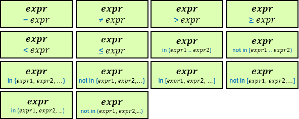
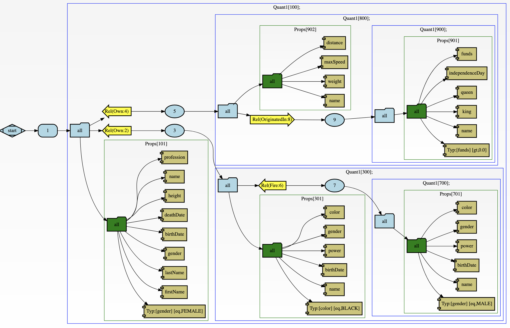

# Ontology Query Language
## Intro
A [property graph](https://en.wikipedia.org/wiki/Graph_property) is a graph data structure that consists of a set of vertices (also known as nodes) and edges.
Each [vertex] represents an entity (such as a person, place, or thing) and can have a set of properties (key-value pairs) associated with it.
Each [edge] represents a relationship between two vertices and can also have a set of properties associated with it.

The [ontology](https://en.wikipedia.org/wiki/Ontology_(computer_science)) of a property graph refers to the structure and organization of the vertices and edges within the graph.
In particular, it refers to the way in which the vertices and edges are connected to one another.

A schema is a way of specifying the structure and organization of a property graph, including the types of vertices and edges that can exist within the graph and the properties that can be associated with them.

An Ontological Query Language (OQL) is a tool used to retrieve and manipulate data from a property graph. OQL is a declarative language that allows users to specify the patterns they are interested in finding within a property graph.

For example, a user might use OQL to find all the vertices in the graph that represent people and have a specific property (such as a name or age), or to find all the edges in the graph that represent friendships between people.

**Operations**
OQL includes a number of different operations that can be used to manipulate and retrieve data from a property graph.

[Constraints](): This operation allows users to specify conditions that must be met in order for a vertex or edge to be included in the results of a query. For example, a user might use the Filter operation to find all the people in the graph who are older than a specific age.

[(RETURN) As](): This operation allows users to specify the data that they want to retrieve from the graph. For example, a user might use the '(RETURN) As'  operation to retrieve the names of all the people in the graph who are friends with a specific person.

[Quantifier](): This operation allows users to specify additional pattern of vertices and edges that they want to find in the graph in addition to an existing pattern which is to be continued by the patterns following the quantifier.

There are additional operations and features available in OQL, and it is a powerful tool for working with property graphs.

---
### Entity Types

Elements of the Ontology Query Language - OQL


A vertex can be one of the next:

* **CONCRETE ENTITY** – Specific entity in the graph
* **TYPED ENTITY** – A subclass of typed entity category / categories
* **UNTYPED ENTITY** – Entity of Un specified type

### Relationship

A logical relationship type is defined by a pattern:

* Two typed/untyped entities in the pattern
* A relationship type name assigned to each such relationship
* A logical relationship type can be either directional or bidirectional.


### Constraints (Filters)
A filter on entities or relationships which refer to non-concrete entities.




### Quantifiers

* Quantifier can be used when there is a need to satisfy more than one constraint.
* Quantifier can combine both constraints and relations


---
### Data Types, Operators, and Functions
OQL supports the following primitive data types:

* Integer types
* Real types (floating-point)
* String
* Date
* datetime
* duration

### Vocabulary:
_**Start**_ – The query start vertex

#### Entities
Entity can belong to one of the next categories:	

* **EUntyped** – Untyped Entity
* **ETyped** –Typed Entity
  * Has list of possible types
* **EConcrete** – Concrete Entity Type
  * Has a concrete id

#### Relationships
Relationship has direction & type (Can support untyped relations)

* **Rel** – Relationship

#### Properties
Every relation & entity can have properties.

* **RelProp** – Relationship property
* **EProp** – Entity property

Properties have name, type (data type) & constraint:

* **RelPropGroup** – Relationship property group
* **EPropGroup** – Entity property group

#### Constraint

Constraint is combined of an operator and an expression.

A constraint filters assignment to only those assignments for which the value of the expression for the assigned entity/relationship satisfies the constraint.

#### Start vertex
 Every query begin element, each query element number appears in the rectangle brackets.
 
 Quantifiers sub-elements appear in the curly brackets.

Example
-------

Query as a json document:

```json
{
  "name": "Q1",
  "elements": [
    {
      "eNum": 0,
      "type": "",
      "next": 1
    },
    {
      "eNum": 1,
      "type": "EConcrete",
      "eTag": "A",
      "eID": "12345678",
      "eType": "Person",
      "eName": "Brandon Stark",
      "next": 2
    },
    {
      "eNum": 2,
      "type": "Rel",
      "rType": "own",
      "dir": "R",
      "next": 3
    },
    {
      "eNum": 3,
      "type": "ETyped",
      "eTag": "B",
      "eType": "Dragon"
    }
  ]
}
```

Additional simple string representation:
```text
    Start [0]: EConcrete [1]: Rel [2]: ETyped [3]
```
Each query has a name and a (linked) list of elements which are labeled with :
* **eNum** - sequence number
* **eTag** – a named tag used for results labeling

Visual representation of a complicated OQL query:


---

Query with quantifier and property constraint 
```json
{
  "name": "Q10",
  "elements": [
    {
      "eNum": 0,
      "type": "Start",
      "next": 1
    },
    {
      "eNum": 1,
      "type": "ETyped",
      "eTag": "A",
      "eType": "Person",
      "next": 2
    },
    {
      "eNum": 2,
      "type": "Quant1",
      "qType": "all",
      "next": [
        3,
        4
      ]
    },
    {
      "eNum": 3,
      "type": "EProp",
      "pType": 1,
      "pTag": 1,
      "con": {
        "op": "eq",
        "expr": "Brandon"
      }
    },
    {
      "eNum": 4,
      "type": "Rel",
      "eType": "own",
      "dir": "R",
      "next": 5
    },
    {
      "eNum": 5,
      "type": "ETyped",
      "eTag": "B",
      "eType": "Dragon",
      "next": 6
    }]
}
```
Additional simple string representation:

```test
   Start [0]: ETyped [1]: Quant1 [2]:{3|4}: EProp [3]: Rel [4]: ETyped [5]
```
